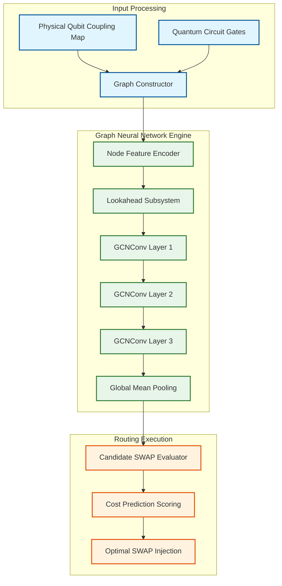

# System Architecture Design

```mermaid
graph TD
    %% Input Layer
    subgraph Input Processing
        A[Physical Qubit Coupling Map] --> C[Graph Constructor]
        B[Quantum Circuit Gates] --> C
    end

    %% GNN Engine
    subgraph Graph Neural Network Engine
        C --> D[Node Feature Encoder]
        D --> E[Lookahead Subsystem]
        
        E --> F[GCNConv Layer 1]
        F --> G[GCNConv Layer 2]
        G --> H[GCNConv Layer 3]
        
        H --> I[Global Mean Pooling]
    end

    %% Output Layer
    subgraph Routing Execution
        I --> J[Candidate SWAP Evaluator]
        J --> K[Cost Prediction Scoring]
        K --> L[Optimal SWAP Injection]
    end

    %% Styling
    classDef input fill:#e1f5fe,stroke:#01579b,stroke-width:2px;
    classDef engine fill:#e8f5e9,stroke:#2e7d32,stroke-width:2px;
    classDef output fill:#fff3e0,stroke:#e65100,stroke-width:2px;
    
    class A,B,C input;
    class D,E,F,G,H,I engine;
    class J,K,L output;
```
